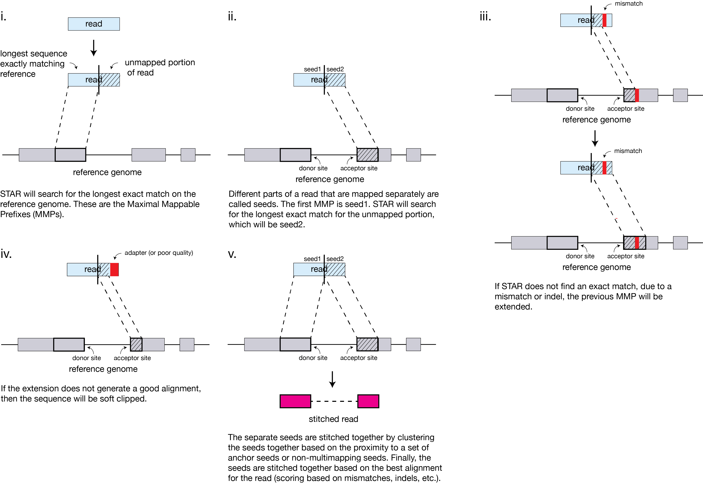

## README



Material on STAR adapted from https://github.com/hbctraining/Intro-to-rnaseq-hpc-O2 distributed under the terms of the [Attribution 4.0 International (CC BY 4.0 license)](https://creativecommons.org/licenses/by/4.0/).

## Testing data

Data from [The transcriptional landscape and mutational profile of lung adenocarcinoma](https://www.ncbi.nlm.nih.gov/pmc/articles/PMC3483540/) deposited accession number [ERP001058](https://www.ncbi.nlm.nih.gov/geo/query/acc.cgi?acc=GSE40419) and raw data deposited at the SRA under [ERP001058](https://www.ncbi.nlm.nih.gov/sra?term=ERP001058).

Download [NCBI SRA Toolkit](https://trace.ncbi.nlm.nih.gov/Traces/sra/sra.cgi?view=software) to download data.

```bash
wget https://ftp-trace.ncbi.nlm.nih.gov/sra/sdk/2.10.8/sratoolkit.2.10.8-ubuntu64.tar.gz
tar -xzf sratoolkit.2.10.8-ubuntu64.tar.gz

# add bin to your PATH
# export PATH=$PATH:/where/you/downloaded/src/sratoolkit.2.10.8-ubuntu64/bin

# then run the config tool
vdb-config --interactive
```

Download data using `fasterq-dump`.

```bash
for acc in ERR164550 ERR164559 ERR164560 ERR164563 ERR164569 ERR164585 ERR164613; do
   echo $acc
   fasterq-dump -p --outdir fastq ${acc}
done
```

